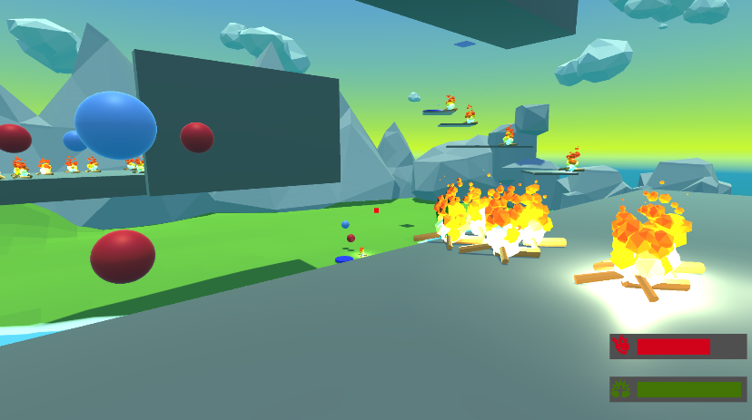

# 🧱 Sparta Dungeon Explorer

Unity 2022.3.17f1 LTS로 개발된 3D 플랫포머 게임입니다.  
플레이어는 다양한 기믹과 플랫폼을 활용해 높은 곳을 탐험하게 됩니다.

---

## 🎮 게임 정보

- 장르: 3D 플랫포머 / 던전 탐험
- 플랫폼: PC (Unity 기반)
- 조작 방식:
  - `WASD` + 마우스 이동
  - `Space`: 점프 (더블 점프 가능)
  - `Tab`: 퍼즈(일시정지)
  - 마우스 클릭: 특정 아이템과 상호작용

---

## ⚙️ 주요 시스템

### 🔵 파란 구슬
- 먹으면 더블 점프 스택을 1회 추가

### 🔴 빨간 구슬
- 좌클릭으로 쏘면 캐릭터가 자동 점프

### 🧩 기타 기믹
- 움직이는 플랫폼
- 밟으면 사라지는 트롤링 플랫폼

---

## 💀 게임 오버 조건

- 체력이 0이 되면 현재 씬을 재시작합니다.

---

## 🧪 개발 환경

- Unity 2022.3.17f1 LTS

---

## 🖼️ 스크린샷

## 🧩 트러블슈팅 기록 (TIL 링크)

- https://github.com/OnionKimchi/Sparta_git/blob/OnionKimchi-TIL/250520
- https://github.com/OnionKimchi/Sparta_git/blob/OnionKimchi-TIL/250521
- https://github.com/OnionKimchi/Sparta_git/blob/OnionKimchi-TIL/250522

